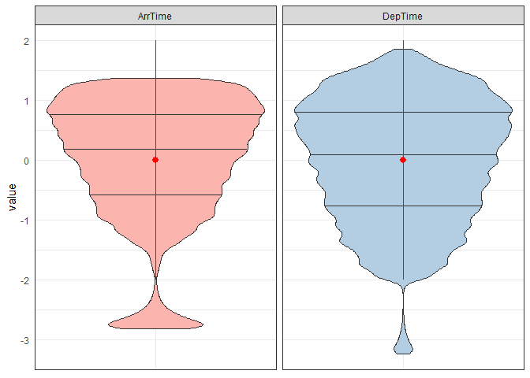

Exploratory analysis of datasets
================
Agrita Garnizone
May, 2018

Purpose of this Notebook is to perform exploratory analysis for multiple data sets which are used later on when building Gaussian Process Regression both in R and Python. All data sets are selected as they have been used in literature before.

### Table of Content:

-   Toy data: synthetic data
-   SARCOS dataset
-   Abalone dataset
-   Airline dataset

Before importing and describing all data sets, necessary libraries are imported.

``` r
#for data manipulation and trasformation:
library(dplyr) # version: 0.7.2

# for melting data frames in form ggplot2 requires
library(reshape2)

# for data visualization
library(ggplot2)
library(gridExtra)

# for reading MatLab files (.mat). 
library(rmatio)  #version 0.12.0

# manipulation with time
library(lubridate)
```

### Toy data: synthetic data

For demonstration purposes synthetic data will be generated based on functions: 

``` r
set.seed(1313)
# sample size
N = 10^6

# feature variable
x <- sample(seq(0.01, 3, length.out=N))
# target variable 
y <- 0.5*x + 0.3^(x^2) + 
  sample(seq(from = 0, to=0.05*(1+max(x)^2), length.out = N)) + 
  sample(seq(from = 0, to=100, length.out = N))

# put in one data.frame
df_toy <- data.frame(x = x, y = y)

# save for future-experiments
write.csv(df_toy, "../data_sources/Synthetic_data_set/synthetic_data.csv",
          row.names = FALSE)
```

``` r
df_toy <- read.csv("../data_sources/Synthetic_data_set/synthetic_data.csv")
```

To validte that both variables are not highly correlated to each other, Pearson's correlation coefficient is calculated.

``` r
cor(df_toy$x,df_toy$y)
```

    ## [1] 0.005096692

### SARCOS dataset

SARCOS is the data set used by [Rasmussen and Williams (2006)](http://www.gaussianprocess.org/gpml/chapters/RW.pdf) and later on also on [E.Snelson (2007)](http://www.gatsby.ucl.ac.uk/~snelson/thesis.pdf). The Data relates to an inverse dynamic problem for SARCOS anthropomorphic robot arm - i.e., map from the 21 dimensional joint position, velocity, and acceleration space to the torque at a single joint.

As stated by Rasmussen and Williams, the inputs are linearly rescaled to have zero mean and unit variance on the training set. The outputs were centered so as to have zero mean on the training set.

And just like [Rasmussen and Williams (2006)](http://www.gaussianprocess.org/gpml/chapters/RW.pdf), [E.Snelson (2007)](http://www.gatsby.ucl.ac.uk/~snelson/thesis.pdf), [A.Banerjee et al (2008)](https://arxiv.org/pdf/1106.5779.pdf) and many others - task is to map 21 input variables to the first of the seven torques.

``` r
# data set for training
df_sarcos <- rmatio::read.mat("http://www.gaussianprocess.org/gpml/data/sarcos_inv.mat") %>%
             as.data.frame()
df_sarcos <- df_sarcos[,1:22]
names(df_sarcos) <- c(paste("feature", 1:21, sep = "_"), "target")

# data set for testing
df_sarcos_test <- rmatio::read.mat("http://www.gaussianprocess.org/gpml/data/sarcos_inv_test.mat") %>%
                  as.data.frame()
df_sarcos_test <- df_sarcos_test[,1:22]
names(df_sarcos_test) <- c(paste("feature", 1:21, sep = "_"), "target")
```

Data set contains more than 44k observations and 22 dimensions as stated before.

``` r
dim(df_sarcos)
```

    ## [1] 44484    22

Before model creation, exploratory data analysis are performed. Starting with data value summary visualized with boxplots for each joint group - position, velocity and acceleration space. Violin plots helps to understand distribution of data, and within violins you can see drawn quantiles (three horizontal lines - Q1, Q2, Q3), and mean value +/- standard deviation (red dot with red lines).

``` r
df_sacros_visualization <- reshape2::melt(df_sarcos[,1:21]) %>%
    dplyr::mutate(group = 
            ifelse(variable %in% c(paste("feature", 1:7, sep="_")),"position",
            ifelse(variable %in% c(paste("feature", 8:14, sep="_")),"velocity",
                   "acceleration")))
ggplot(data = 
   df_sacros_visualization[which(df_sacros_visualization$group == "position"),], 
        aes(x=variable, y=value)) + 
   geom_violin(aes(fill=variable), draw_quantiles = c(0.25, 0.5, 0.75)) +
   scale_fill_brewer(palette="Pastel1") +
   theme_bw()+
   theme(axis.text.x=element_text(angle=45, vjust=1, size=10, hjust=1),
        axis.ticks = element_blank(),
        axis.title.x = element_blank(), 
        legend.title = element_blank()) + 
   stat_summary(fun.data=mean_sdl, geom="pointrange", color="red")
```


``` r
ggplot(data = 
   df_sacros_visualization[which(df_sacros_visualization$group == "velocity"),], 
        aes(x=variable, y=value)) + 
   geom_violin(aes(fill=variable), draw_quantiles = c(0.25, 0.5, 0.75)) +
   scale_fill_brewer(palette="Pastel2") +
   theme_bw()+
   theme(axis.text.x=element_text(angle=45, vjust=1, size=10, hjust=1),
        axis.ticks = element_blank(),
        axis.title.x = element_blank(), 
        legend.title = element_blank()) + 
   stat_summary(fun.data=mean_sdl, geom="pointrange", color="red") 
```


``` r
ggplot(data = 
   df_sacros_visualization[which(df_sacros_visualization$group == 
                                   "acceleration"),], 
        aes(x=variable, y=value)) + 
   geom_violin(aes(fill=variable), draw_quantiles = c(0.25, 0.5, 0.75)) +
   scale_fill_brewer(palette="Set2") +
   theme_bw()+
   theme(axis.text.x=element_text(angle=45, vjust=1, size=10, hjust=1),
        axis.ticks = element_blank(),
        axis.title.x = element_blank(), 
        legend.title = element_blank()) + 
   stat_summary(fun.data=mean_sdl, geom="pointrange", color="red")
```


To understand how correlated our inputs are, correlation heatmap with respective correlations is shown below.

``` r
df_sarcos_corr <- round(cor(df_sarcos[,1:21]),2)
df_sarcos_corr[upper.tri(df_sarcos_corr)] <- NA
df_sarcos_corr_melted <- reshape2::melt(df_sarcos_corr, na.rm = TRUE)


ggplot(data = df_sarcos_corr_melted, aes(x=Var1, y=Var2, fill=value)) + 
  geom_tile(color = "white") +
  scale_fill_gradient2(low = "blue", high = "red", mid = "white", 
   midpoint = 0, limit = c(-1,1), space = "Lab", 
   name="Pearson\nCorrelation")+
  geom_raster() +
  theme_bw()+
  theme(axis.text.x=element_text(angle=45, vjust=1, size=10, hjust=1),
        axis.title.x = element_blank(),
        axis.title.y = element_blank(),
        panel.grid.major = element_blank(),
        panel.border = element_blank(),
        #panel.background = element_blank(),
        axis.ticks = element_blank(),
        legend.justification = c(1, 0),
        legend.position = c(0.6, 0.7),
        legend.direction = "horizontal")+
  coord_fixed()+
  guides(fill = guide_colorbar(barwidth = 7, barheight = 1,
                title.position = "top", title.hjust = 0.5)) + 
  geom_text(aes(Var1, Var2, label = value), color = "black", size = 2)
```


### Abalone dataset

Abalone data set contains data of abalones aiming to predict the age of abalone from physical measurements. The age of abalone is determined by cutting the shell through the cone, staining it, and counting the number of rings through a microscope -- a boring and time-consuming task. Other measurements, which are easier to obtain, are used to predict the age.

Data comes from an original (non-machine-learning) study: *Warwick J Nash, Tracy L Sellers, Simon R Talbot, Andrew J Cawthorn and Wes B Ford (1994)* **"The Population Biology of Abalone (*Haliotis* species) in Tasmania. I. Blacklip Abalone (*H. rubra*) from the North Coast and Islands of Bass Strait"**, Sea Fisheries Division, Technical Report No. 48 (ISSN 1034-3288).

Data set can be downloaded from [Machine Learning Repository](https://archive.ics.uci.edu/ml/datasets/abalone).

``` r
df_abalone <- read.csv("../data_sources/Abalone_data_set/abalone_data_set.csv",
                       stringsAsFactors = FALSE)
```

``` r
dim(df_abalone)
```

    ## [1] 4177    9

Although data set is fairly small and full-GP can be created in reasonable time, this data set was selected also by [Snelson (2007)](http://www.gatsby.ucl.ac.uk/~snelson/thesis.pdf) as data illustrates useful results. Violin plots again will be plotted by groups to make it easier to understand distributions and values.

``` r
df_abalone_melt <- reshape2::melt({df_abalone %>% select(-rings)}, 
                                  id.vars = "sex") %>%
  mutate(sex = ifelse(sex=="F", "Female", ifelse(sex=="M", "Male", "Infant")))

ggplot(data = df_abalone_melt[which(df_abalone_melt$variable %in% 
                                         c("length", "diameter", "height")),], 
          aes(x=variable, y=value, fill = sex)) + 
   geom_violin(draw_quantiles = c(0.25, 0.5, 0.75)) +
   scale_fill_brewer(palette="Pastel1") +
   facet_grid(.~variable, scales = "free")+
   theme_bw()+
   theme(
        axis.text.x=element_blank(),
        axis.ticks = element_blank(),
        axis.title.x = element_blank(), 
        legend.title = element_blank()) 
```


``` r
ggplot(data = df_abalone_melt[which(df_abalone_melt$variable %in% 
                      c("shucked_weight", "viscera_weight", "shell_weight")),], 
          aes(x=variable, y=value, fill = sex)) + 
   geom_violin(draw_quantiles = c(0.25, 0.5, 0.75)) +
   scale_fill_brewer(palette="Pastel1") +
   facet_grid(.~variable, scales = "free")+
   theme_bw()+
   theme(
        axis.text.x=element_blank(),
        axis.ticks = element_blank(),
        axis.title.x = element_blank(), 
        legend.title = element_blank()) 
```


``` r
ggplot(data = df_abalone_melt[which(df_abalone_melt$variable %in% 
                      c("whole_height")),], 
          aes(x=variable, y=value, fill = sex)) + 
   geom_violin(draw_quantiles = c(0.25, 0.5, 0.75)) +
   scale_fill_brewer(palette="Pastel1") +
   facet_grid(.~variable, scales = "free")+
   theme_bw()+
   theme(
        axis.text.x=element_blank(),
        axis.ticks = element_blank(),
        axis.title.x = element_blank(), 
        legend.title = element_blank()) 
```


To understand how correlated our inputs are, correlation heatmap with respective correlations is shown below. One should not be surprised that all of the columns are correlated with each other as physical measurements typically are highly correlated. Column *rings* (aka target column) also is added to understand how correlated input features are with target value.

``` r
#first column is gender = {Female, Male, Infant}
df_abalone_corr <- round(cor(df_abalone[,2:9]),2)
df_abalone_corr[upper.tri(df_abalone_corr)] <- NA
df_abalone_corr_melted <- reshape2::melt(df_abalone_corr, na.rm = TRUE)

ggplot(data = df_abalone_corr_melted, aes(x=Var1, y=Var2, fill=value)) + 
  geom_tile(color = "white") +
  scale_fill_gradient2(low = "blue", high = "red", mid = "white", 
   midpoint = 0, limit = c(-1,1), space = "Lab", 
   name="Pearson\nCorrelation")+
  geom_raster() +
  theme_bw()+
  theme(axis.text.x=element_text(angle=45, vjust=1, size=10, hjust=1),
        axis.title.x = element_blank(),
        axis.title.y = element_blank(),
        panel.grid.major = element_blank(),
        panel.border = element_blank(),
        #panel.background = element_blank(),
        axis.ticks = element_blank(),
        legend.justification = c(1, 0),
        legend.position = c(0.6, 0.7),
        legend.direction = "horizontal")+
  coord_fixed()+
  guides(fill = guide_colorbar(barwidth = 7, barheight = 1,
                title.position = "top", title.hjust = 0.5)) + 
  geom_text(aes(Var1, Var2, label = value), color = "black", size = 2)
```


### Airline dataset

Airline data set contains all information records of US commercial flights in 2008. As wrote [Maziar Raissi (2017)](https://arxiv.org/abs/1704.03144), this data set has reached status of a standard benchmark data set in Gaussian process regression, partly due to massive size of the dataset.

Airline data set [originally](http://stat-computing.org/dataexpo/2009/the-data.html) contains ∼7 × 10<sup>6</sup> observations (after removing missing values, it is ∼1.5 × 10<sup>6</sup> ) which is enough *big* for full-GP and even some of the approximations to handle.

``` r
# .. for parent directory as original working directory for all R scripts are
# under /grp-big-data/grp_in_R
df_airline <- read.csv("../data_sources/Airline_data_set/airline_2008.csv",
                       stringsAsFactors = FALSE)
```

Following [Maziar Raissi (2017)](https://arxiv.org/abs/1704.03144) and [James Hensman et al (2013)](https://arxiv.org/abs/1309.6835) example, 8 of the many variables available for this data sets are inclued in the model: the age of the aircraft (number of years since deployment\_\*\_), distance that needs to be covered, airtime, departure time, arrival time, day of the week, day of the month and month.

-   the age of aircraft was not in the original data set, but is available by joining [*plane-data.csv*](http://stat-computing.org/dataexpo/2009/supplemental-data.html) data.

``` r
plane_df <- read.csv("../data_sources/Airline_data_set/plane-data.csv",
                       stringsAsFactors = FALSE)
plane_df = plane_df %>%
  select(tailnum, year) %>%
  # data quality issue, for consistency all missing values are NAs, not None etc
  mutate(year = ifelse(year == "None", NA, year)) %>%
  rename(!!'Year' := 'year')

df_airline = 
  df_airline %>% 
  # filter out missing values
  filter(complete.cases(.)) %>%
  # keep selected feature variables; TailNum for join
  select(Month, DayofMonth, DayOfWeek, ArrTime, DepTime, AirTime, Distance, 
         ArrDelay, TailNum) %>%
  # left join for aircraft's year 
  left_join(plane_df, by = c(TailNum = "tailnum")) %>%
  # convert to numeric
  mutate(Year = as.numeric(Year)) %>%
  # again filter out missing values 
  # (might happen as plane data above contains missing values for some TailNums)
  filter(complete.cases(.)) %>%
  # filter out TailNum column
  select(-TailNum)
```

Arrival time and departure time is currently in form of *HHMM*, and needs to be transformed into mintues, where *1* means *00:00am*, but *1440* are *11:59pm*.

``` r
## from int to string
df_airline[c("ArrTime", "DepTime")] <- 
                 apply(df_airline[c("ArrTime", "DepTime")], MARGIN = 2, 
                 FUN = function (x) as.character(x))

## padding 0 for missig leading zeros
df_airline[c("ArrTime", "DepTime")] <- 
                 apply(df_airline[c("ArrTime", "DepTime")], MARGIN = 2, 
                 FUN = function (x) stringr::str_pad(x, 4, pad = "0"))

#converting from HHMM to HH:MM 
df_airline[c("ArrTime", "DepTime")] <- 
                 apply(df_airline[c("ArrTime", "DepTime")], MARGIN = 2, 
                 FUN = function (x) paste(substr(x, 1, 2), substr(x, 3, 4), 
                                          sep = ":"))
# with help of lubridate package change to minutes 
df_airline[c("ArrTime", "DepTime")] <- 
                 apply(df_airline[c("ArrTime", "DepTime")], MARGIN = 2, 
                 FUN = function (x) as.numeric(lubridate::hm(x))/60)
```

A standard procedure of data processing, data is standardized by substracting the sample mean and dividing with standard deviation.

``` r
df_airline_standardized <- apply(df_airline, MARGIN = 2, 
                                 FUN = function (x) (x-mean(x))/sd(x)) %>%
  as.data.frame()

# save for future use: 
# write.csv(df_airline_standardized, 
#           "Airline_data_set/airline_standardized.csv",
#           row.names = FALSE)
```

Structure of data is shown below. To understand better value, visualization for columns like *Month, DayofMonth, DayOfWeek* is done with un-standardized values (model is created on standardized values). And histograms for these columns does not surprise. From histogram down below we can also see that data are quite evenlty distributed across whole year, month and day of the week.

``` r
df_airline_visualization <- reshape2::melt({df_airline %>%
                                      select(Month, DayofMonth, DayOfWeek)})
plot_1 <- ggplot(data =
   df_airline_visualization, aes(x=value)) +
   geom_histogram(data = subset(df_airline_visualization, variable == "Month"),
                  bins=12, alpha=0.4, position="identity", colour="grey40",
                  fill = RColorBrewer::brewer.pal(n=9,"Pastel1")[1]) +
   scale_x_continuous("Month", breaks = c(seq(1,12)), labels = c(seq(1,12))) +
   ylab("Frequency") +
   theme_bw()+
   theme(panel.grid.major = element_blank(),
        panel.border = element_blank(),
        axis.ticks = element_blank(),
        legend.position="none")

plot_2 <- ggplot(data =
   df_airline_visualization, aes(x=value)) +
   geom_histogram(data = subset(df_airline_visualization,
                                variable == "DayofMonth"),
                  bins=30, alpha=0.4, position="identity", colour="grey40",
                  fill = RColorBrewer::brewer.pal(n=9,"Pastel1")[2]) +
   scale_x_continuous("Day of the Month", breaks = c(1,seq(5,30, by =5)),
                     labels = c(1,seq(5,30, by =5))) +
   ylab("Frequency") +
   theme_bw()+
   theme(panel.grid.major = element_blank(),
        panel.border = element_blank(),
        axis.ticks = element_blank(),
        legend.position="none")

plot_3 <- ggplot(data =
   df_airline_visualization, aes(x=value)) +
   geom_histogram(data = subset(df_airline_visualization,
                                variable == "DayOfWeek"),
                  bins=7, alpha=0.4, position="identity", colour="grey40", 
                  fill = RColorBrewer::brewer.pal(n=9,"Pastel1")[3]) +
   scale_x_continuous("Day of the Week", breaks = c(seq(1,7)),
                      labels = c(seq(1,7)))+
   theme_bw()+
   theme(axis.title.y = element_blank(),
        panel.grid.major = element_blank(),
        panel.border = element_blank(),
        axis.ticks = element_blank(),
        legend.position="none")

grid.arrange(plot_1, plot_3, plot_2,
             layout_matrix = rbind(c(1, 2),
                                   c(3, 3)))
```


Histograms, boxplots and violin plots for rest of feature variables. For *AirTime* is plotted to enhance how many outliers are there.

``` r
df_airline_visualization <- reshape2::melt({df_airline_standardized %>% 
                                                              select(Distance)})
ggplot(data =
   df_airline_visualization, aes(x=value)) +
   geom_histogram(alpha=0.6, position="identity", colour="grey40", 
                  fill = RColorBrewer::brewer.pal(n=9,"Pastel1")[4], 
                  binwidth = 0.1) +
   labs(x = "Distance (miles)", y = "Frequency") + 
   theme_bw()+
   theme(panel.grid.major = element_blank(),
         panel.border = element_blank(),
         axis.ticks = element_blank(),
         legend.position="none")
```


``` r
df_airline_visualization <- reshape2::melt({df_airline_standardized %>% 
                                                select(ArrTime, DepTime)})

ggplot(data = df_airline_visualization,aes(x=variable, y=value, 
                                                     fill = variable)) +
          geom_violin(draw_quantiles = c(0.25, 0.5, 0.75)) +
           scale_fill_brewer(palette="Pastel1") +
           facet_grid(.~variable, scales = "free")+
           theme_bw()+
           theme(
                axis.text.x=element_blank(),
                axis.ticks = element_blank(),
                axis.title.x = element_blank(), 
                legend.position = "None") + 
   stat_summary(fun.data=mean_sdl, geom="pointrange", color="red")
```



``` r
df_airline_visualization <- reshape2::melt({df_airline_standardized %>% 
                                                select(AirTime)})
ggplot(data =
   df_airline_visualization,aes(x=variable, y=value)) +
   geom_boxplot(fill=RColorBrewer::brewer.pal(n=9,"Pastel1")[6]) + 
   theme_bw()+
   theme(axis.text.x=element_text(vjust=1, size=10, hjust=1),
         axis.title = element_blank(),
         axis.ticks = element_blank(),
        axis.title.x = element_blank(),
        legend.position = "None") +
   stat_summary(fun.data=mean_sdl, geom="pointrange", color="red") + 
   coord_flip()
```


``` r
df_airline_corr <- signif(cor(df_airline_standardized),2)
df_airline_corr[upper.tri(df_airline_corr)] <- NA
df_airline_corr_melted <- reshape2::melt(df_airline_corr, na.rm = TRUE)


ggplot(data = df_airline_corr_melted, aes(x=Var1, y=Var2, fill=value)) +
  geom_tile(color = "white") +
  scale_fill_gradient2(low = "blue", high = "red", mid = "white",
   midpoint = 0, limit = c(-1,1), space = "Lab",
   name="Pearson\nCorrelation")+
  geom_raster() +
  theme_bw()+
  theme(axis.text.x=element_text(angle=45, vjust=1, size=10, hjust=1),
        axis.title.x = element_blank(),
        axis.title.y = element_blank(),
        panel.grid.major = element_blank(),
        panel.border = element_blank(),
        #panel.background = element_blank(),
        axis.ticks = element_blank(),
        legend.justification = c(1, 0),
        legend.position = c(0.6, 0.7),
        legend.direction = "horizontal")+
  coord_fixed()+
  guides(fill = guide_colorbar(barwidth = 7, barheight = 1,
                title.position = "top", title.hjust = 0.5)) +
  geom_text(aes(Var1, Var2, label = value), color = "black", size = 2)
```


