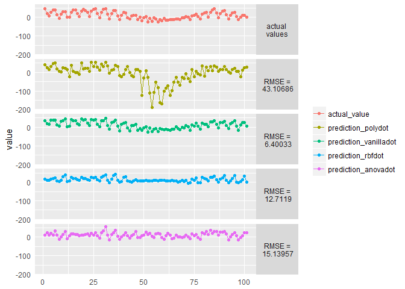
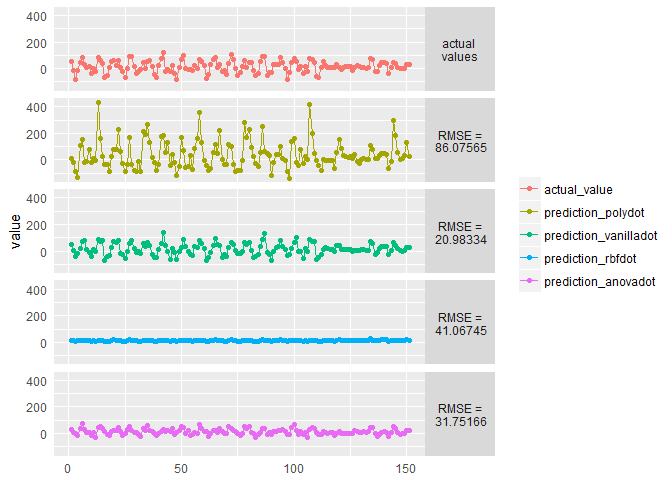
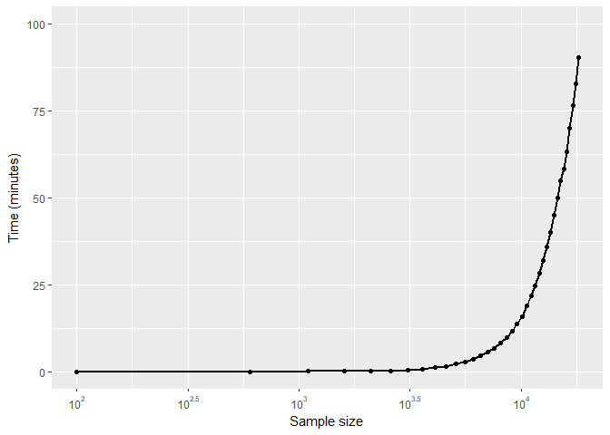
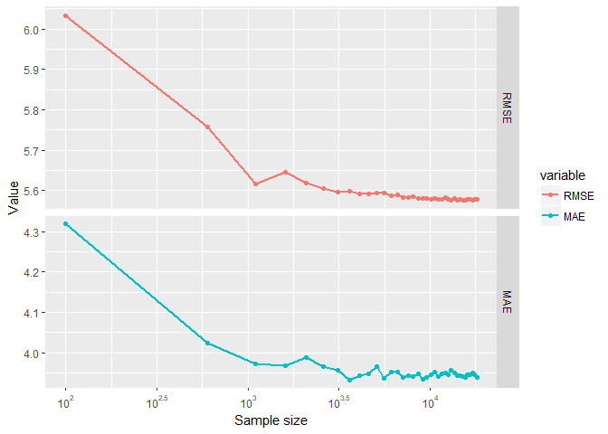
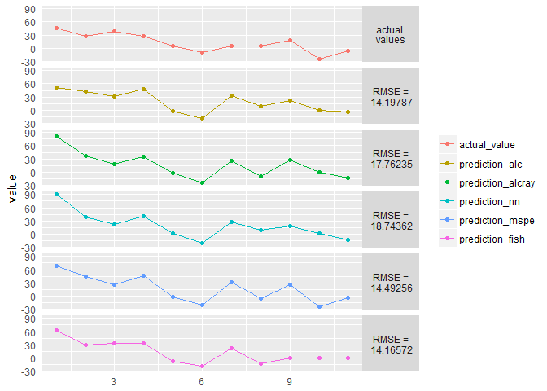
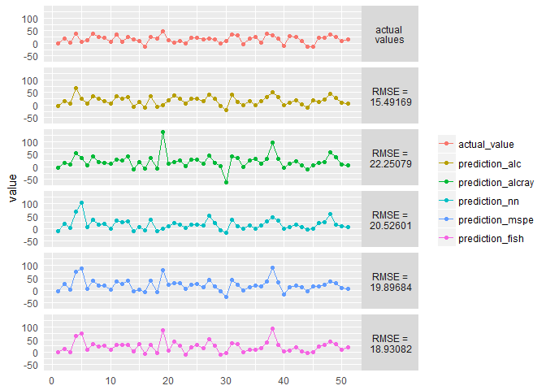

Gaussian Process Regression for Big Data in R
================
Agrita Garnizone
May, 2018

Gaussian Process models are heavily used for Bayesian nonlinear regression (and classification) problems - quite typical Machine Learning tasks. Gaussian process is non-parametric - meaning model's complexity grows as the observation count increases out of which follows biggest (and most mentioned) limitation - computational difficulties for Big Data.

Purpose of this Notebook is to research and compare current opportunities of creating Gaussian Process Regression models for Big Data in R. In this Notebook we will create models for multiple datasets of various dimensions and data set sizes. All data sets are selected as they have been used in literature before.

Before importing and describing all data sets, necessary libraries are imported.

``` r
#for data manipulation and trasformation:
library(dplyr)        # version: 0.7.2

# for melting data frames in form ggplot2 requires
library(reshape2)     # version: 1.4.3

# for data visualization
library(ggplot2)      # version: 2.2.1
library(gridExtra)    # version: 2.3 
library(scales)       # version: 0.5.0

# for reading MatLab files (.mat). 
library(rmatio)       # version 0.12.0
```

``` r
source("R/calculate_MAE.R")
source("R/calculate_RMSE.R")
```

#### The SARCOS dataset

SARCOS is the data set used by [Rasmussen and Williams (2006)](http://www.gaussianprocess.org/gpml/chapters/RW.pdf) and later on also on [E.Snelson (2007)](http://www.gatsby.ucl.ac.uk/~snelson/thesis.pdf). The Data relates to an inverse dynamic problem for SARCOS anthropomorphic robot arm - i.e., map from the 21 dimensional joint position, velocity, and acceleration space to the torque at a single joint.

Exploratory analysis of the dataset have been performed in [Exploratory analysis of datasets]() Markdown file.

``` r
# data set for training
df_sarcos <- rmatio::read.mat("http://www.gaussianprocess.org/gpml/data/sarcos_inv.mat") %>%
             as.data.frame()
df_sarcos <- df_sarcos[,1:22]
names(df_sarcos) <- c(paste("feature", 1:21, sep = "_"), "target")

# data set for testing
df_sarcos_test <- rmatio::read.mat("http://www.gaussianprocess.org/gpml/data/sarcos_inv_test.mat") %>%
                  as.data.frame()
df_sarcos_test <- df_sarcos_test[,1:22]
names(df_sarcos_test) <- c(paste("feature", 1:21, sep = "_"), "target")
```

Gaussian Process Regression models in R
---------------------------------------

### Package 'kernlab'

Package contains kernel-based machine learning methods for classification, regression, clustering, novelty detection, quantile regression and dimensionality reduction; including Gaussian Processes for regression and clasification with function *gausspr()*.

``` r
library(kernlab) # version 0.9.25
```

If we would want to create model on whole data set, we would receive memory error due to data set size (even if we do not use cross-validation for model tuning), which is why we will created multiple models starting with sample size =100 and will increase until run out of memory.

Before that though, we will create model with sample size of *n* = 500 to test out some of the kernels for SARCOS data set.

``` r
# creating empty data frame to evaluate predictions
evaluation_sarcos_df <- data.frame(matrix(nrow = nrow(df_sarcos_test), ncol = 0))
# SARCOS test data set's 22th column values are the actual values
evaluation_sarcos_df$actual_value <- df_sarcos_test[, 22]
# and then assigning to next 4 columns respecitve predictions. For testing whole
# SARCOS test data set is used (4449 observations)
evaluation_sarcos_df$prediction_polydot    <- predict(model_sarcos_polydot, 
                                                      df_sarcos_test[, 1:21]) %>%
                                              as.vector()
evaluation_sarcos_df$prediction_vanilladot <- predict(model_sarcos_vanilladot, 
                                                      df_sarcos_test[, 1:21]) %>%
                                              as.vector()
evaluation_sarcos_df$prediction_rbfdot     <- predict(model_sarcos_rbfdot, 
                                                      df_sarcos_test[, 1:21]) %>%
                                              as.vector()
evaluation_sarcos_df$prediction_anovadot   <- predict(model_sarcos_anovadot, 
                                                      df_sarcos_test[, 1:21]) %>%
                                              as.vector()

# evaluate created models with RMSE and MAE. For most of the models created
# above default values for hyper-parameters are used. 
evaluate_models_df <- rbind(
          {lapply(evaluation_sarcos_df[,2:5], 
          function(x) calculate_RMSE(evaluation_sarcos_df[,1],x)) %>% 
                      as.data.frame() },
          {lapply(evaluation_sarcos_df[,2:5], 
          function(x) calculate_MAE(evaluation_sarcos_df[,1],x)) %>% 
                      as.data.frame() }
          ) %>% `rownames<-`(c("RMSE","MAE"))

print(evaluate_models_df)
```

    ##      prediction_polydot prediction_vanilladot prediction_rbfdot
    ## RMSE           51.76616             11.034497          16.49296
    ## MAE            32.89789              7.724181          11.41808
    ##      prediction_anovadot
    ## RMSE            15.87853
    ## MAE             11.68933

For visualization purposes all models are plotted to enhance performance of kernels, but as there are way too many observations in the test set to display in one plot function *plot\_section\_of\_predictions()* is created which takes previously created data frame of all prediction values versus actual value, and two integers - where from and till which value plot should be created.

``` r
# df - previously created data frame == evaluation_sarcos_df
# from - indicates where to start the sequence
# to - indicates where to stop the sequence
plot_section_of_predictions <- function(df, from, to){
  
    df_melted <- reshape2::melt({df[from:to,] %>% 
                                mutate(i = seq(1:n()))},
                                id.vars = "i")
    splitted_df <- lapply(df[from:to,2:5], 
              function(x) calculate_RMSE(df[from:to,1],x)) %>% 
                          as.data.frame() %>% 
                          round(digits = 5) %>%
                          mutate_all(as.character)
    
    # attaching RMSE data frame for convenience when referring
    attach(splitted_df)
    plotted_predictions <-
      ggplot(df_melted, 
            aes(x = i, y = value, color=variable)) +
            geom_line() + 
            geom_point() +
            facet_grid(variable~., 
                      labeller = labeller(variable = 
            c('actual_value' = "actual \nvalues", 
            'prediction_polydot' = paste("RMSE =\n",prediction_polydot),
            'prediction_vanilladot' = paste("RMSE =\n",prediction_vanilladot),
            'prediction_rbfdot' = paste("RMSE =\n",prediction_rbfdot),
            'prediction_anovadot' = paste("RMSE =\n",prediction_anovadot)))
                  ) + 
            theme(axis.ticks = element_blank(),
                  axis.title.x = element_blank(), 
                  legend.title = element_blank(),
                  strip.text.y = element_text(angle = 0))
    detach(splitted_df)
    return(plotted_predictions)
}

plot_section_of_predictions(evaluation_sarcos_df, 10, 50)
```


``` r
plot_section_of_predictions(evaluation_sarcos_df, 1000, 1100)
```



``` r
plot_section_of_predictions(evaluation_sarcos_df, 2450, 2600)
```



As lowest RMSE and MAE value is for *vanilladot* (or simply - linear) kernel, it will be used for further experiments.

``` r
# create sample set size sequence from original data frame == df_sarcos, starting
# with n=100 and increasing size by 500 until reaches nrow of data frame
sample_size = seq(100, nrow(df_sarcos), by = 500)

# initialize empty data frame to record metrics
experiment_data <- data.frame(sample_size = NA, 
                   time.taken = NA,
                   RMSE = NA,
                   MAE = NA,
                   time.taken.test = NA)

# go through all sample sizes while it runs out of memory
# NOT RUN: 
    ## loop will take some time while going through all sample sets
    ## and as we are originally sampling, this loop should be executed multiple
    ## times to increase accuracy of all metrics.
    for (i in sample_size){
        sample_rows <- sample(nrow(df_sarcos), size = i, replace = FALSE)
        x_sample <- df_sarcos[sample_rows,1:21]
        y_sample <- df_sarcos[sample_rows,22]
    
        start.time <- Sys.time()
        tryCatch(
            gausspr_model <- gausspr(x_sample, y_sample, variance.model=T,
                             kerne='vanilladot'),
            error = function(error){
              stop((paste("Error while creating model for sample with size of",
                    as.character(i)))
                   )
              })
    
        end.time <- Sys.time()
        time.taken <- difftime(end.time, start.time, units = "secs")
    
        start.time <- Sys.time()
        predicted_values = predict(gausspr_model, df_sarcos_test[,1:21]) %>%
                           as.vector()
        end.time <- Sys.time()
        time.taken.test <- difftime(end.time, start.time, units = "secs")
    
        RMSE_value = calculate_RMSE(df_sarcos_test[,22], predicted_values)
        MAE_value = calculate_MAE(df_sarcos_test[,22], predicted_values)
    
        experiment_data <- rbind(experiment_data,
                                 data.frame(sample_size = i,
                                       time.taken = time.taken,
                                       RMSE = RMSE_value,
                                       MAE = MAE_value,
                                       time.taken.test = time.taken.test))
        print(paste("sample data set with size of",as.character(i),", RSME:",
                    as.character(RMSE_value),
                    "in time", as.character(time.taken)))
    }
# End(not run)

# saving results for visualization purposes
write.csv(experiment_data, "~/output/kernlab_sarcos_evaluation.csv", 
          row.names = FALSE)
```

After obtaining experiment results, we can visualize all metrics, compare how well can *kernlab* package perform.

``` r
experiment_data <- read.csv("./output/kernlab_sarcos_evaluation.csv")
experiment_data = experiment_data %>%
                      # won't be included in the visualization
                      dplyr::select(-time.taken.test)

# time.taken here is in seconds. As thousands of seconds are not very 
# user-friendly unit to visualize, seconds will be transformed to minutes and
# rounded to 6 digits.
experiment_data = experiment_data %>%
  dplyr::mutate(time.taken = signif(time.taken/60,6))

summary(experiment_data)
```

    ##   sample_size      time.taken            RMSE            MAE       
    ##  Min.   :  100   Min.   : 0.00062   Min.   :5.576   Min.   :3.932  
    ##  1st Qu.: 4600   1st Qu.: 1.55842   1st Qu.:5.579   1st Qu.:3.941  
    ##  Median : 9100   Median :11.73490   Median :5.582   Median :3.946  
    ##  Mean   : 9100   Mean   :23.81268   Mean   :5.604   Mean   :3.961  
    ##  3rd Qu.:13600   3rd Qu.:39.97950   3rd Qu.:5.594   3rd Qu.:3.952  
    ##  Max.   :18100   Max.   :90.47710   Max.   :6.033   Max.   :4.319

``` r
experiment_data_melt <- reshape2::melt(experiment_data, id.vars = "sample_size")

ggplot(experiment_data_melt[which(experiment_data_melt$variable == "time.taken"),], 
       aes(x = sample_size, y= value)) +
  geom_line(size = 1) + geom_point() +
  xlab("Sample size") +
  ylab("Time (minutes)") +
  ylim(0,100) + 
  scale_x_continuous(trans = log10_trans(),
    breaks = trans_breaks("log10", function(x) 10^x),
    labels = trans_format("log10", math_format(10^.x)))
```



``` r
ggplot(experiment_data_melt[which(experiment_data_melt$variable != "time.taken"),], 
       aes(x = sample_size, y= value, col = variable)) +
  geom_line(size = 1) + geom_point() +
  facet_grid(variable~., scales = "free_y", space = "free_y")+
  xlab("Sample size") +
  ylab("Value") +
  scale_x_continuous(trans = log10_trans(),
    breaks = trans_breaks("log10", function(x) 10^x),
    labels = trans_format("log10", math_format(10^.x)))
```



By taking a look on evaluation results, it's quite impressive that with sample\_size=100, model perform so well on test set (RSME=6.033 and MAE=4.319), but time spent on model creation is overwhelming (e.g., for model where sample\_size=18′100, you would need more than 1.5h for training).

### Package 'laGP'

Package provides functions for (local) approximate Gaussian process modeling and prediction for large spatial data and the emulation of large computer experiments as stated in package's [vignette](https://cran.r-project.org/web/packages/laGP/vignettes/laGP.pdf). The methods in the laGP package take a two-pronged approach to large data GP regression. They (1) leverage sparsity, but in fact only work with small dense matrices. And (2) the many-independent nature of calculations facilitates massive parallelization. The result is an approximate GP regression capability that can accommodate orders of magnitude larger training and testing sets than ever before.

``` r
library(laGP) # version 1.5.1
```

Just as before, we will start with creating a model for SARCOS (sampled to 500 observations and 100 from test set) to vizually evaluate how well model created with laGP functions performs. As laGP's algorithm is transductive learning procedure we cannot directly compare results (especially *time.taken*) with other packages and functions (e.g., kernlab::gausspr).

``` r
# Generate empirical Bayes regularization (priors) and choose initial values 
# and ranges for (isotropic) lengthscale and nugget parameters 
# to a Gaussian correlation function for a GP regression model
d_prior <- laGP::darg(list(mle=TRUE), df_sarcos[1:500,1:21], samp.size=100)

sample_rows <- sample(nrow(df_sarcos_test), size = 100, 
                                 replace = FALSE)
df_sarcos_test_sample  <- df_sarcos_test[sample_rows,1:21]
# creating models with multiple methods and due to transductive learning 
# procedure also test set's feature columns are passed.
model_sarcos_alc    <- laGP::aGP(X = df_sarcos[1:500,1:21], 
                                 Z = df_sarcos[1:500,22], 
                                 XX = df_sarcos_test_sample,
                                 d = d_prior,
                                 method = "alc",
                                 omp.threads=16)
model_sarcos_alcray <- laGP::aGP(X = df_sarcos[1:500,1:21],
                                 Z = df_sarcos[1:500,22],
                                 XX = df_sarcos_test_sample,
                                 d = d_prior,
                                 method = "alcray",
                                 omp.threads=16)
model_sarcos_nn     <- laGP::aGP(X = df_sarcos[1:500,1:21], 
                                 Z = df_sarcos[1:500,22], 
                                 XX = df_sarcos_test_sample, 
                                 d = d_prior,
                                 method = "nn",
                                 omp.threads=16)
model_sarcos_mspe   <- laGP::aGP(X = df_sarcos[1:500,1:21], 
                                 Z = df_sarcos[1:500,22], 
                                 XX = df_sarcos_test_sample,
                                 d = d_prior,
                                 method = "mspe",
                                 omp.threads=16)
model_sarcos_fish   <- laGP::aGP(X = df_sarcos[1:500,1:21], 
                                 Z = df_sarcos[1:500,22], 
                                 XX = df_sarcos_test_sample,
                                 d = d_prior,
                                 method = "fish",
                                 omp.threads=16)
```

``` r
# creating empty data frame to evaluate predictions
evaluation_sarcos_df <- data.frame(matrix(nrow = nrow(df_sarcos_test_sample), 
                                          ncol = 0))
# SARCOS test data set's 22th column values are the actual values
evaluation_sarcos_df$actual_value <- df_sarcos_test[sample_rows, 22]
# and then assigning to next 5 columns respecitve predictions. For testing whole
# SARCOS test data set is used (4449 observations)
evaluation_sarcos_df$prediction_alc    <- model_sarcos_alc$mean
evaluation_sarcos_df$prediction_alcray <- model_sarcos_alcray$mean
evaluation_sarcos_df$prediction_nn     <- model_sarcos_nn$mean
evaluation_sarcos_df$prediction_mspe   <- model_sarcos_mspe$mean
evaluation_sarcos_df$prediction_fish   <- model_sarcos_fish$mean

# evaluate created models with RMSE and MAE. For most of the models created
# above default values for hyper-parameters are used. 
evaluate_models_df <- rbind(
          {lapply(evaluation_sarcos_df[,2:6], 
          function(x) calculate_RMSE(evaluation_sarcos_df[,1],x)) %>% 
                      as.data.frame() },
          {lapply(evaluation_sarcos_df[,2:6], 
          function(x) calculate_MAE(evaluation_sarcos_df[,1],x)) %>% 
                      as.data.frame() }
          ) %>% `rownames<-`(c("RMSE","MAE"))

print(evaluate_models_df)
```

    ##      prediction_alc prediction_alcray prediction_nn prediction_mspe
    ## RMSE       15.53570          19.44635      18.68358        20.09338
    ## MAE        11.33815          12.58863      12.85903        13.34345
    ##      prediction_fish
    ## RMSE        20.38611
    ## MAE         13.40998

Depending on sample, lowest evaluation metrics - both RMSE and MAE - are for Alcray, NN or ALC methd. As model is created in a different manner than kernlab, for visualization purposes plotted will be prediction from all model versus actual value from the test set.

``` r
# df - previously created data frame == evaluation_sarcos_df
# from - indicates where to start the sequence
# to - indicates where to stop the sequence
plot_section_of_predictions <- function(df, from, to){
  
    df_melted <- reshape2::melt({df[from:to,] %>% 
                                mutate(i = seq(1:n()))},
                                id.vars = "i")
    splitted_df <- lapply(df[from:to,2:ncol(df)], 
              function(x) calculate_RMSE(df[from:to,1],x)) %>% 
                          as.data.frame() %>% 
                          round(digits = 5) %>%
                          mutate_all(as.character)
    
    # attaching RMSE data frame for convenience when referring
    attach(splitted_df)
    plotted_predictions <-
      ggplot(df_melted, 
            aes(x = i, y = value, color=variable)) +
            geom_line() + 
            geom_point() +
            facet_grid(variable~., 
                      labeller = labeller(variable = 
            c('actual_value' = "actual \nvalues", 
            'prediction_alc' = paste("RMSE =\n",prediction_alc),
            'prediction_alcray' = paste("RMSE =\n",prediction_alcray),
            'prediction_nn' = paste("RMSE =\n",prediction_nn),
            'prediction_mspe' = paste("RMSE =\n",prediction_mspe),
            'prediction_fish' = paste("RMSE =\n",prediction_fish) ))
                  ) + 
            theme(axis.ticks = element_blank(),
                  axis.title.x = element_blank(), 
                  legend.title = element_blank(),
                  strip.text.y = element_text(angle = 0))
    detach(splitted_df)
    return(plotted_predictions)
}

plot_section_of_predictions(evaluation_sarcos_df, 10, 20)
```



``` r
plot_section_of_predictions(evaluation_sarcos_df, 50, 100)
```


