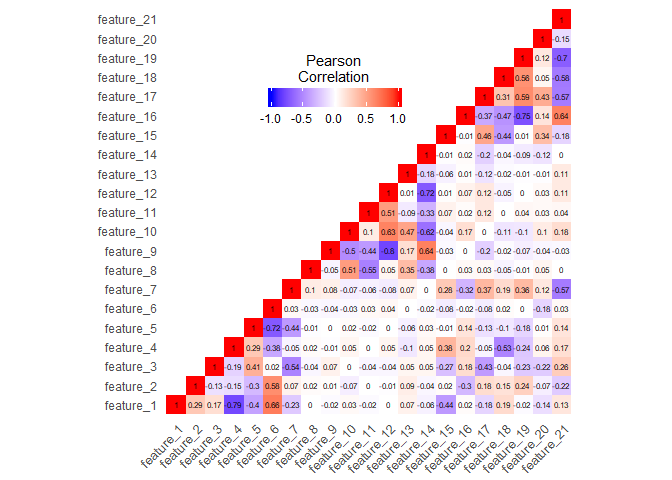
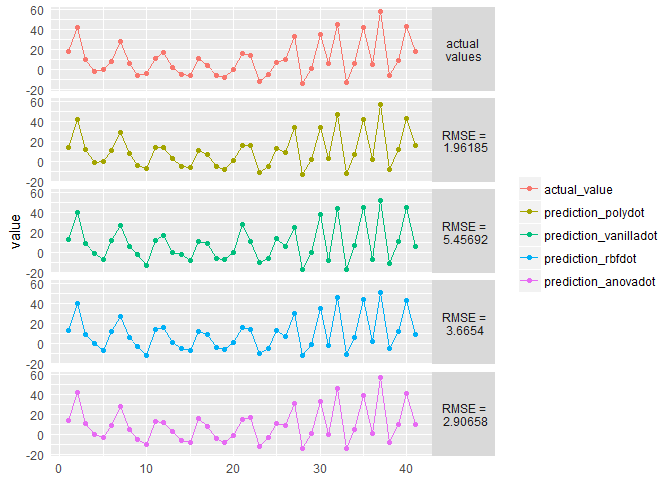
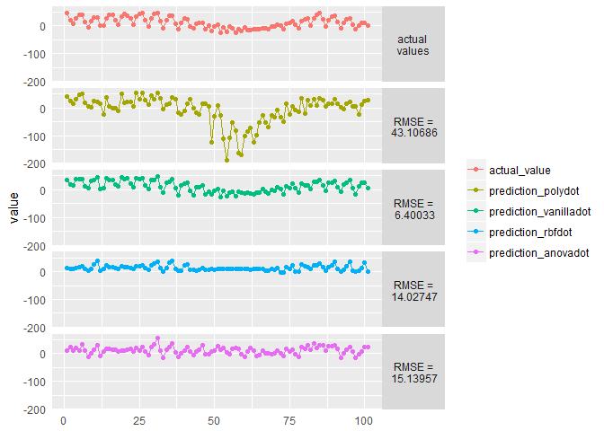

Gaussian Process Regression for Big Data in R
================
Agrita Garnizone
May, 2018

Gaussian Process models are heavily used for Bayesian nonlinear regression (and classification) problems - quite typical Machine Learning tasks. Gaussian process is non-parametric - meaning model's complexity grows as the observation count increases out of which follows biggest (and most mentioned) limitation - computational difficulties for Big Data.

Purpose of this Notebook is to research and compare current opportunities of creating Gaussian Process Regression models for Big Data in R. In this Notebook we will create models for multiple datasets of various dimensions and data set sizes. All data sets are selected as they have been used in literature before.

Before importing and describing all data sets, necessary libraries are imported.

``` r
#for data manipulation and trasformation:
library(dplyr) # version: 0.7.2

# for melting data frames in form ggplot2 requires
library(reshape2)

# for data visualization
library(ggplot2)
library(gridExtra)

# for reading MatLab files (.mat). 
library(rmatio)  #version 0.12.0
```

``` r
source("R/calculate_MAE.R")
source("R/calculate_RMSE.R")
```

#### The SARCOS dataset

SARCOS is the data set used by [Rasmussen and Williams (2006)](http://www.gaussianprocess.org/gpml/chapters/RW.pdf) and later on also on [E.Snelson (2007)](http://www.gatsby.ucl.ac.uk/~snelson/thesis.pdf). The Data relates to an inverse dynamic problem for SARCOS anthropomorphic robot arm - i.e., map from the 21 dimensional joint position, velocity, and acceleration space to the torque at a single joint.

As stated by Rasmussen and Williams, the inputs are linearly rescaled to have zero mean and unit variance on the training set. The outputs were centered so as to have zero mean on the training set.

And just like [Rasmussen and Williams (2006)](http://www.gaussianprocess.org/gpml/chapters/RW.pdf), [E.Snelson (2007)](http://www.gatsby.ucl.ac.uk/~snelson/thesis.pdf), [A.Banerjee et al (2008)](https://arxiv.org/pdf/1106.5779.pdf) and many others - task is to map 21 input variables to the first of the seven torques.

``` r
# data set for training
df_sarcos <- rmatio::read.mat("http://www.gaussianprocess.org/gpml/data/sarcos_inv.mat") %>%
             as.data.frame()
df_sarcos <- df_sarcos[,1:22]
names(df_sarcos) <- c(paste("feature", 1:21, sep = "_"), "target")

# data set for testing
df_sarcos_test <- rmatio::read.mat("http://www.gaussianprocess.org/gpml/data/sarcos_inv_test.mat") %>%
                  as.data.frame()
df_sarcos_test <- df_sarcos_test[,1:22]
names(df_sarcos_test) <- c(paste("feature", 1:21, sep = "_"), "target")
```

Data set contains more than 44k observations and 22 dimensions as stated before.

``` r
dim(df_sarcos)
```

    ## [1] 44484    22

Before model creation, exploratory data analysis are performed. Starting with data value summary visualized with boxplots for each joint group - position, velocity and acceleration space. Violin plots helps to understand distribution of data, and within violins you can see drawn quantiles (three horizontal lines - Q1, Q2, Q3), and mean value +/- standard deviation (red dot with red lines).

``` r
df_sacros_visualization <- reshape2::melt(df_sarcos[,1:21]) %>%
    dplyr::mutate(group = 
            ifelse(variable %in% c(paste("feature", 1:7, sep="_")),"position",
            ifelse(variable %in% c(paste("feature", 8:14, sep="_")),"velocity",
                   "acceleration")))
```

    ## No id variables; using all as measure variables

``` r
ggplot(data = 
   df_sacros_visualization[which(df_sacros_visualization$group == "position"),], 
        aes(x=variable, y=value)) + 
   geom_violin(aes(fill=variable), draw_quantiles = c(0.25, 0.5, 0.75)) +
   scale_fill_brewer(palette="Pastel1") +
   theme_bw()+
   theme(axis.text.x=element_text(angle=45, vjust=1, size=10, hjust=1),
        axis.ticks = element_blank(),
        axis.title.x = element_blank(), 
        legend.title = element_blank()) + 
   stat_summary(fun.data=mean_sdl, geom="pointrange", color="red")
```


``` r
ggplot(data = 
   df_sacros_visualization[which(df_sacros_visualization$group == "velocity"),], 
        aes(x=variable, y=value)) + 
   geom_violin(aes(fill=variable), draw_quantiles = c(0.25, 0.5, 0.75)) +
   scale_fill_brewer(palette="Pastel2") +
   theme_bw()+
   theme(axis.text.x=element_text(angle=45, vjust=1, size=10, hjust=1),
        axis.ticks = element_blank(),
        axis.title.x = element_blank(), 
        legend.title = element_blank()) + 
   stat_summary(fun.data=mean_sdl, geom="pointrange", color="red") 
```


``` r
ggplot(data = 
   df_sacros_visualization[which(df_sacros_visualization$group == 
                                   "acceleration"),], 
        aes(x=variable, y=value)) + 
   geom_violin(aes(fill=variable), draw_quantiles = c(0.25, 0.5, 0.75)) +
   scale_fill_brewer(palette="Set2") +
   theme_bw()+
   theme(axis.text.x=element_text(angle=45, vjust=1, size=10, hjust=1),
        axis.ticks = element_blank(),
        axis.title.x = element_blank(), 
        legend.title = element_blank()) + 
   stat_summary(fun.data=mean_sdl, geom="pointrange", color="red")
```


To understand how correlated our inputs are, corellation heatmap with respective correlations is shown below.

``` r
df_sarcos_corr <- round(cor(df_sarcos[,1:21]),2)
df_sarcos_corr[upper.tri(df_sarcos_corr)] <- NA
df_sarcos_corr_melted <- reshape2::melt(df_sarcos_corr, na.rm = TRUE)


ggplot(data = df_sarcos_corr_melted, aes(x=Var1, y=Var2, fill=value)) + 
  geom_tile(color = "white") +
  scale_fill_gradient2(low = "blue", high = "red", mid = "white", 
   midpoint = 0, limit = c(-1,1), space = "Lab", 
   name="Pearson\nCorrelation")+
  geom_raster() +
  theme_bw()+
  theme(axis.text.x=element_text(angle=45, vjust=1, size=10, hjust=1),
        axis.title.x = element_blank(),
        axis.title.y = element_blank(),
        panel.grid.major = element_blank(),
        panel.border = element_blank(),
        #panel.background = element_blank(),
        axis.ticks = element_blank(),
        legend.justification = c(1, 0),
        legend.position = c(0.6, 0.7),
        legend.direction = "horizontal")+
  coord_fixed()+
  guides(fill = guide_colorbar(barwidth = 7, barheight = 1,
                title.position = "top", title.hjust = 0.5)) + 
  geom_text(aes(Var1, Var2, label = value), color = "black", size = 2)
```



Gaussian Process Regression models in R
---------------------------------------

### Package 'kernlab'

Package containing kernel-based machine learning methods for classification, regression, clustering, novelty detection, quantile regression and dimensionality reduction; including Gaussian Processes for regression and clasification with function *gausspr()*.

``` r
library(kernlab) # version 0.9.25
```

If we would want to create model on whole data set, we would receive memory error due to data set size (even if we do not use cross-validation for model tuning), which is why we will created multiple models starting with sample size =100 and will increase until run out of memory.

Before that though, we will create model with sample size of *n* = 500 to test out some of the kernels for SARCOS data set.

``` r
# creating empty data frame to evaluate predictions
evaluation_sarcos_df <- data.frame(matrix(nrow = nrow(df_sarcos_test), ncol = 0))
# SARCOS test data set's 22th column values are the actual values
evaluation_sarcos_df$actual_value <- df_sarcos_test[, 22]
# and then assigning to next 4 columns respecitve predictions. For testing whole
# SARCOS test data set is used (4449 observations)
evaluation_sarcos_df$prediction_polydot    <- predict(model_sarcos_polydot, 
                                                      df_sarcos_test[, 1:21]) %>%
                                              as.vector()
evaluation_sarcos_df$prediction_vanilladot <- predict(model_sarcos_vanilladot, 
                                                      df_sarcos_test[, 1:21]) %>%
                                              as.vector()
evaluation_sarcos_df$prediction_rbfdot     <- predict(model_sarcos_rbfdot, 
                                                      df_sarcos_test[, 1:21]) %>%
                                              as.vector()
evaluation_sarcos_df$prediction_anovadot   <- predict(model_sarcos_anovadot, 
                                                      df_sarcos_test[, 1:21]) %>%
                                              as.vector()

# evaluate created models with RMSE and MAE. For most of the models created
# above default values for hyper-parameters are used. 
evaluate_models_df <- rbind(
          {lapply(evaluation_sarcos_df[,2:5], 
          function(x) calculate_RMSE(evaluation_sarcos_df[,1],x)) %>% 
                      as.data.frame() },
          {lapply(evaluation_sarcos_df[,2:5], 
          function(x) calculate_MAE(evaluation_sarcos_df[,1],x)) %>% 
                      as.data.frame() }
          ) %>% `rownames<-`(c("RMSE","MAE"))

print(evaluate_models_df)
```

    ##      prediction_polydot prediction_vanilladot prediction_rbfdot
    ## RMSE           51.76616             11.034497          17.05805
    ## MAE            32.89789              7.724181          11.89087
    ##      prediction_anovadot
    ## RMSE            15.87853
    ## MAE             11.68933

For visualization purposes all models are plotted to enhance performance of kernels, but as there are way too many observations in the test set to display in one plot function *plot\_section\_of\_predictions()* is created which takes previously created data frame of all prediction values versus actual value, and two integers - where from and till which value plot should be created.

``` r
# df - previously created data frame == evaluation_sarcos_df
# from - indicates where to start the sequence
# to - indicates where to stop the sequence
plot_section_of_predictions <- function(df, from, to){
  
    df_melted <- reshape2::melt({df[from:to,] %>% 
                                mutate(i = seq(1:n()))},
                                id.vars = "i")
    splitted_df <- lapply(df[from:to,2:5], 
              function(x) calculate_RMSE(df[from:to,1],x)) %>% 
                          as.data.frame() %>% 
                          round(digits = 5) %>%
                          mutate_all(as.character)
    
    # attaching RMSE data frame for convenience when referring
    attach(splitted_df)
    plotted_predictions <-
      ggplot(df_melted, 
            aes(x = i, y = value, color=variable)) +
            geom_line() + 
            geom_point() +
            facet_grid(variable~., 
                      labeller = labeller(variable = 
            c('actual_value' = "actual \nvalues", 
            'prediction_polydot' = paste("RMSE =\n",prediction_polydot),
            'prediction_vanilladot' = paste("RMSE =\n",prediction_vanilladot),
            'prediction_rbfdot' = paste("RMSE =\n",prediction_rbfdot),
            'prediction_anovadot' = paste("RMSE =\n",prediction_anovadot)))
                  ) + 
            theme(axis.ticks = element_blank(),
                  axis.title.x = element_blank(), 
                  legend.title = element_blank(),
                  strip.text.y = element_text(angle = 0))
    detach(splitted_df)
    return(plotted_predictions)
}

plot_section_of_predictions(evaluation_sarcos_df, 10, 50)
```



``` r
plot_section_of_predictions(evaluation_sarcos_df, 1000, 1100)
```



``` r
plot_section_of_predictions(evaluation_sarcos_df, 2450, 2600)
```


As lowest *R**M**S**E* and *M**A**E* value is for *vanilladot* (or simply - linear) kernel, it will be used for further experiments.
